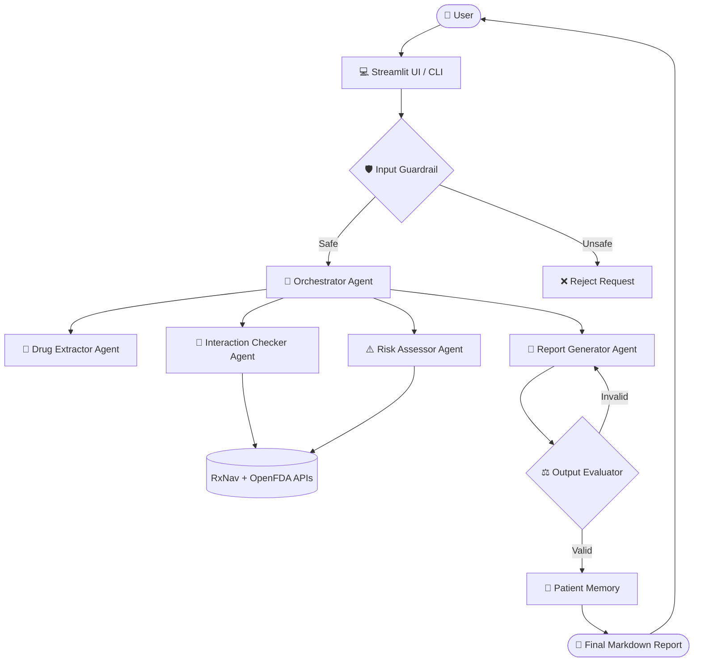

# 🏥 MediTrace: AI-Powered Medication Safety Assistant

<div align="center">
  <p><strong>Protecting Patients with Intelligent, Multi-Agent Medication Risk Analysis.</strong></p>
  
  
  
  
  
  
  
</div>

## 📖 Project Overview
MediTrace is an advanced, AI-powered medication safety assistant designed to help users understand potential drug interactions and adverse event risks. By combining the **Google Agent Development Kit (ADK)** with deterministic fallback architectures, MediTrace orchestrates multiple AI sub-agents to extract drug information, check clinical databases, analyze risk severity, and present patient-friendly markdown safety reports.

Whether run via the Streamlit GUI or the blazing-fast CLI, MediTrace guarantees high-quality insights supported by real-world clinical APIs (**RxNav** and **OpenFDA**).

---

## ✨ Key Features
- **Intelligent Drug Extraction**: Uses LLM parsing and deterministic fallbacks to parse fuzzy user inputs into verified drug entities.
- **Deep Interaction Detection**: Queries the NIH RxNav/DrugBank APIs to detect known contraindications and drug-drug interactions.
- **OpenFDA Evidence Analysis**: Aggregates real-world adverse event reports to detect high-frequency side effects (e.g., Acute Kidney Injury, Haemorrhage).
- **Dynamic Risk Classification**: Employs evidence-based scoring logic to flag major risks ("See a doctor today") vs. moderate risks ("Watch out for").
- **Patient Memory**: Tracks active patient prescriptions across sessions using secure session management.
- **Robust Guardrails**: Utilizes strict Input Guards to reject unsafe prompts and Output Evaluators to ensure report quality and medical disclaimers.
- **Local No-Billing Execution**: Includes a deterministic fallback pipeline that allows 100% free local execution without relying on Vertex AI API billing.

---

## 🧠 AI Engineering Highlights
MediTrace is built on modern Agentic AI principles to ensure reliability and safety in medical domains:
- **Multi-Agent Architecture**: Decouples extraction, interaction checking, risk assessment, and report generation into specialized agents.
- **Tool Calling (MCP)**: Agents are equipped with tools to execute real HTTP requests to federal databases.
- **Evaluators**: The `output_guard.py` features a retry-loop LLM evaluator that guarantees formatting and safety disclaimers before outputting to the user.
- **Guardrails**: `input_guard.py` intercepts malicious injections before they hit the orchestrator.
- **Stateful Memory**: Integrates `InMemoryMemoryService` to retain historical patient context.

---

## 🏗️ Architecture



---

## ⚙️ Installation

MediTrace is built with Python. Follow these steps to run the application locally.

```bash
# 1. Create a virtual environment
python -m venv .venv

# 2. Activate the virtual environment
# Windows:
.venv\Scripts\activate
# Mac/Linux:
source .venv/bin/activate

# 3. Install dependencies
pip install -r requirements.txt
```

---

## 🚀 Usage

### Option 1: Command Line Interface (CLI)
Run the application directly in your terminal for rapid interaction checks:
```bash
python main.py
```

### Option 2: Streamlit Web UI
Launch the interactive web interface:
```bash
streamlit run frontend/app.py
```

---

## 🧪 Example Outputs

<details>
<summary><b>🚨 Example 1: Aspirin + Warfarin</b></summary>

```markdown
## Your medications
- Aspirin
- Warfarin

## What looks safe
No minor interactions found.

## Watch out for
None

## See a doctor today
### Aspirin & Warfarin
**Severity:** [Major Risk]
**Source:** OpenFDA
**Explanation:** OpenFDA serious reaction keyword detected: haemorrhage.
**Top reported adverse events:**
- Dyspnoea
- International Normalised Ratio Increased
- Fatigue
**Recommended Action:** Please consult your doctor due to potential severe risks.

## Why this matters
- Aspirin + Warfarin: This carries severe risks such as bleeding or kidney issues and requires medical oversight.

## Disclaimer
This report is for information only. It is not medical advice. Always confirm with your doctor or pharmacist before changing any medication.
```

</details>

<details>
<summary><b>⚠️ Example 2: Metformin + Ibuprofen + Lisinopril</b></summary>

```markdown
## Your medications
- Metformin
- Ibuprofen
- Lisinopril

## What looks safe
No minor interactions found.

## Watch out for
None

## See a doctor today
### Metformin & Ibuprofen
**Severity:** [Major Risk]
**Source:** OpenFDA
**Explanation:** OpenFDA serious reaction keyword detected: kidney.
**Top reported adverse events:**
- Acute Kidney Injury
- Nausea
- Chronic Kidney Disease
**Recommended Action:** Please consult your doctor due to potential severe risks.

### Metformin & Lisinopril
**Severity:** [Major Risk]
**Source:** OpenFDA
**Explanation:** OpenFDA serious reaction keyword detected: kidney.
**Top reported adverse events:**
- Nausea
- Diarrhoea
- Fatigue
**Recommended Action:** Please consult your doctor due to potential severe risks.

### Ibuprofen & Lisinopril
**Severity:** [Major Risk]
**Source:** OpenFDA
**Explanation:** OpenFDA serious reaction keyword detected: kidney.
**Top reported adverse events:**
- Fatigue
- Pain
- Chronic Kidney Disease
**Recommended Action:** Please consult your doctor due to potential severe risks.

## Why this matters
- Metformin + Ibuprofen: This carries severe risks such as bleeding or kidney issues and requires medical oversight.
- Metformin + Lisinopril: This carries severe risks such as bleeding or kidney issues and requires medical oversight.
- Ibuprofen + Lisinopril: This carries severe risks such as bleeding or kidney issues and requires medical oversight.

## Disclaimer
This report is for information only. It is not medical advice. Always confirm with your doctor or pharmacist before changing any medication.
```

</details>

---

## 🛠️ Technology Stack
- **Language**: Python 3.10+
- **Agent Framework**: Google ADK (Agent Development Kit)
- **Frontend**: Streamlit
- **Data Validation**: Pydantic
- **Networking**: HTTPX / Requests
- **Clinical APIs**: OpenFDA (Adverse Events), RxNav (Concept IDs), DrugBank (Interactions)

---

## ⚠️ Safety & Disclaimer
> [!WARNING]
> **Not Medical Advice**  
> MediTrace is a software engineering capstone project. All generated reports are for **informational purposes only**.
> - OpenFDA data consists of reported adverse events and **does not prove causation** (i.e., that a drug combination explicitly caused the event).
> - You should **always consult healthcare professionals** (doctors, pharmacists) before starting, stopping, or altering any medication regimen.

---

## 🔮 Future Improvements
- **Optical Character Recognition (OCR)**: Integrating Vision models to extract medications directly from images of prescription bottles.
- **Production Caching**: Adding Redis-backed session management for large-scale deployments.
- **Cloud Deployment**: Containerizing the application for Google Cloud Run deployment with Vertex AI.

---

## 📄 License
This project is provided for educational and portfolio purposes.
All rights are reserved by the author.
